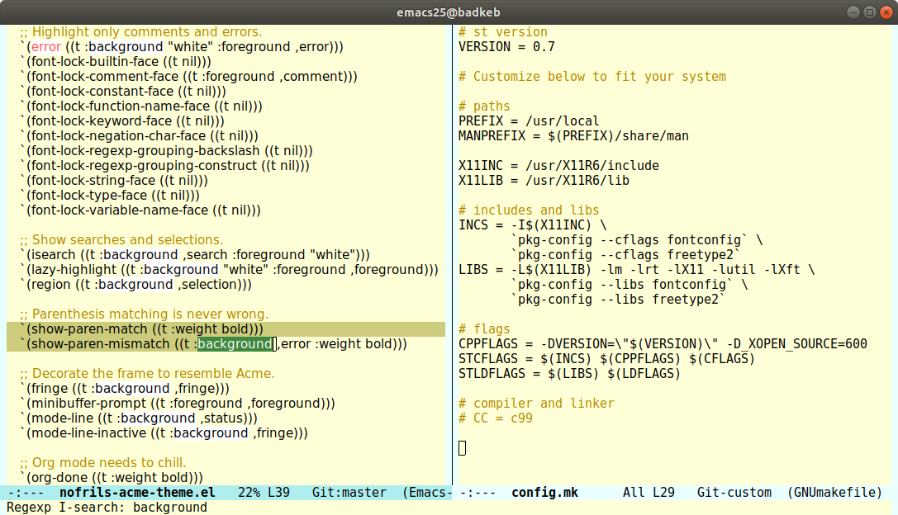

# nofrils-theme

A port of the [No Frils Acme](https://github.com/robertmeta/nofrils)
Vim theme to Emacs.

## What

Minimal syntax highlighting to reduce distractions.  Some coloring is
available, to attenuate comments and enhance errors, but otherwise it
looks a lot like `(global-font-lock-mode -1)`.  The primary benefit is
that other emacs features that rely on the font-lock machinery can
still be used.

## Install

1. Add [MELPA](https://melpa.org/) to your package sources.
2. Install with `M-x package-install RET nofrils-acme-theme RET`.
3. Add `(require 'nofrils-acme-theme)` to your init-file.
4. Activate with `(load-theme 'nofrils-acme t)`.

## Screenshot

## Similar themes

- [eink](https://github.com/maio/eink-emacs)
- [nordless](https://github.com/lthms/nordless-theme.el)
- [plan9](https://github.com/john2x/plan9-theme.el)
- [punpun](https://github.com/wasamasa/punpun-theme)
- [tao](https://github.com/11111000000/tao-theme-emacs)
